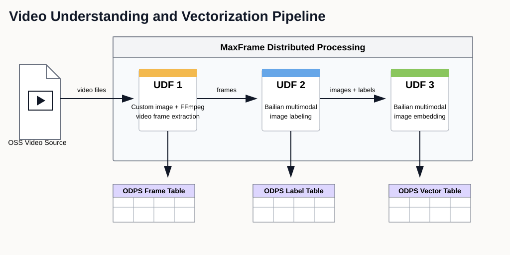
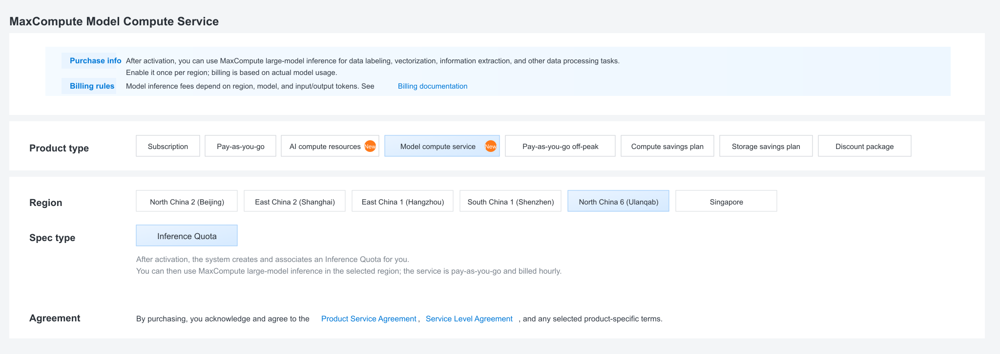

.. _examples_video_pipeline_best_practice:

Video Pipeline: Frame Extraction -> Labeling -> Embedding
=========================================================

.. raw:: html

   
Available at MaxFrame 2.7.1

Background
----------

Autonomous driving systems continuously collect large-scale camera video across road types, traffic conditions, weather, and complex events. These raw videos are critical for model training, scenario mining, data flywheel operations, and evaluation.

Raw video data is usually unstructured and expensive to curate manually. To improve reuse and retrieval efficiency, the data pipeline should standardize frame-level processing:

1. Extract keyframes from videos with FFmpeg.
2. Generate scene labels using multimodal LLMs.
3. Produce embeddings for retrieval, clustering, and sample mining.

This tutorial shows an end-to-end distributed implementation on MaxFrame.

Applicable scenarios
--------------------

- Automatic tagging and management of large video datasets.
- Similar-scene retrieval and sample recall.
- Long-tail and anomaly scenario discovery.
- Dataset clustering and distribution analysis.
- Data preparation for training and evaluation loops.

Workflow
--------

Prerequisites
-------------

.. list-table::
   :header-rows: 1
   :widths: 8 24 68

   * - #
     - Requirement
     - Description
   * - 1
     - **MaxCompute enabled**
     - A MaxCompute project with valid Access ID / Access Key.
   * - 2
     - **DPE enabled**
     - Submit a ticket to enable the DPE engine for your MaxCompute project before running this example.
   * - 3
     - **Video uploaded to OSS**
     - Source videos are stored in a target OSS bucket.
   * - 4
     - **OSS RAM role authorization**
     - Configure Role ARN for OSS mount access.
   * - 5
     - **Model compute service and inference quota**
     - Purchase/enable model compute service and confirm the associated inference quota before running Bailian model inference.
   * - 6
     - **Custom image with FFmpeg**
     - Stage-1 extraction requires FFmpeg in a MaxCompute custom image. The image must be available in the same region as the MaxCompute project.
   * - 7
     - **MaxFrame SDK version**
     - Use MaxFrame SDK **2.7.1** or above (``pip install maxframe>=2.7.1``).

Model compute service and inference quota
-----------------------------------------

In MaxCompute console, purchase/enable model compute service and confirm the
associated inference quota before running Bailian model inference.

Custom image
------------

Why custom image?
~~~~~~~~~~~~~~~~~

Default DPE runtime includes Python but not FFmpeg. Stage-1 frame extraction requires FFmpeg binaries.
For a quick validation run, you can reuse an existing verified FFmpeg image
from the same region. For production, build and publish your own image in the
same region as the MaxCompute project, then set ``odps.session.image`` to that
image name.

Dockerfile example:

.. code-block:: dockerfile

   # syntax=docker/dockerfile:1.6
   FROM --platform=linux/amd64 ubuntu:22.04

   ENV TZ=Asia/Shanghai \
       LANG=en_US.UTF-8 \
       LANGUAGE=en_US:en \
       LC_ALL=en_US.UTF-8 \
       PYTHONIOENCODING=utf-8 \
       TERM=xterm-256color \
       MF_PYTHON_EXECUTABLE=/usr/bin/python3

   RUN sed -i \
           -e 's|http://archive.ubuntu.com/ubuntu/|http://mirrors.aliyun.com/ubuntu/|g' \
           -e 's|http://security.ubuntu.com/ubuntu/|http://mirrors.aliyun.com/ubuntu/|g' \
           /etc/apt/sources.list \
       && apt-get update \
       && DEBIAN_FRONTEND=noninteractive apt-get install -y --no-install-recommends \
           ca-certificates \
           tzdata \
           locales \
           rpm \
           sudo \
           vim \
           git \
           wget \
           curl \
           pkg-config \
           build-essential \
           gdb \
           binutils \
           telnet \
           netcat-openbsd \
           iputils-ping \
           python3 \
           python3-dev \
           python3-pip \
           python3-venv \
           ffmpeg \
           libgfortran5 \
           libgomp1 \
           libnss3 \
           libsqlite3-0 \
           libssl3 \
           zlib1g \
       && locale-gen en_US.UTF-8 \
       && rm -rf /var/lib/apt/lists/*

   RUN python3 -m pip install --no-cache-dir --upgrade pip setuptools wheel \
       && python3 -m pip install --no-cache-dir \
           cloudpickle \
           numpy \
           pandas \
           requests

   RUN groupadd -g 505 admin \
       && useradd -u 505 -g admin -m -d /home/admin -s /bin/bash admin \
       && mkdir -p /workspace \
       && chown -R admin:admin /home/admin /workspace \
       && update-alternatives --install /usr/bin/python python /usr/bin/python3 100 \
       && update-alternatives --install /usr/bin/pip pip /usr/bin/pip3 100

   WORKDIR /workspace

   RUN getconf GNU_LIBC_VERSION \
       && strings /usr/lib/x86_64-linux-gnu/libc.so.6 | grep -q '^GLIBC_2\.34$' \
       && ffmpeg -version >/dev/null \
       && ffprobe -version >/dev/null \
       && "$MF_PYTHON_EXECUTABLE" -c "import ssl, sqlite3, numpy, pandas, requests, cloudpickle; print('runtime ok')"
   CMD ["/bin/bash"]

Environment setup
-----------------

.. code-block:: python

   import glob
   import json
   import math
   import os
   import subprocess

   import pandas as pd
   import maxframe.dataframe as md
   from maxframe.config import options
   from maxframe.learn.contrib.llm import ImageContentType
   from maxframe.learn.utils import read_odps_model
   from maxframe.session import new_session
   from maxframe.udf import with_fs_mount, with_running_options
   from odps import ODPS

   options.sql.settings = {"odps.session.image": "<your_ffmpeg_image_name>"}
   options.dag.settings = {"engine_order": ["DPE", "MCSQL"]}

   o = ODPS(
       access_id="<your_access_id>",
       secret_access_key="<your_secret_access_key>",
       project="<your_maxcompute_project>",
       endpoint="https://service.<region>.maxcompute.aliyun.com/api",
   )
   session = new_session(o)
   print(f"Session ID : {session.session_id}")
   print(f"LogView    : {session.get_logview_address()}")

Global parameters:

.. code-block:: python

   OSS_ENDPOINT = "<your_oss_endpoint>"
   OSS_REGION = "<your_oss_region>"
   OSS_BUCKET = "<your_oss_bucket>"
   OSS_PREFIX = "<your_video_prefix>/".strip("/")
   OSS_ROOT = f"oss://{OSS_ENDPOINT}/{OSS_BUCKET}"
   if OSS_PREFIX:
       OSS_ROOT = f"{OSS_ROOT}/{OSS_PREFIX}"
   OSS_MOUNT_PATH = "/mnt/data"
   OSS_ROLE_ARN = "acs:ram::<account_id>:role/<your_role_name>"

   OSS_ACCESS_KEY_ID = "<your_oss_access_key_id>"
   OSS_ACCESS_KEY_SECRET = "<your_oss_access_key_secret>"
   STORAGE_OPTIONS = {
       "access_key_id": OSS_ACCESS_KEY_ID,
       "access_key_secret": OSS_ACCESS_KEY_SECRET,
   }

   VIDEO_INPUT_TABLE = "mf_video_input"
   FRAME_OUTPUT_TABLE = "mf_video_frame_result"
   LABEL_OUTPUT_TABLE = "mf_video_label_result"
   EMB_OUTPUT_TABLE = "mf_video_embedding_result"

   MODEL_PROJECT = "bigdata_public_modelset"

Make sure the mounted OSS path is correct before submitting the job. For
example, if your OSS address is ``oss://oss-cn-hangzhou.aliyuncs.com/jingxuan-oss-test-hz/``,
use ``OSS_ENDPOINT = "oss-cn-hangzhou.aliyuncs.com"``,
``OSS_BUCKET = "jingxuan-oss-test-hz"``, and ``OSS_PREFIX`` as the
subdirectory that contains your videos.

Stage 0: build video manifest table
-----------------------------------

If you already have an ODPS table with a ``video_path`` column, skip this
stage. Otherwise, use PyODPS and ``alibabacloud_oss_v2`` to scan the OSS
prefix and write one row per video. Stage 1 reads this table directly.

The ``video_path`` value must use exactly the same prefix as ``OSS_ROOT``
(``oss://<endpoint>/<bucket>/<prefix>/...``). If the prefixes do not match,
``with_fs_mount`` path replacement may silently miss the file.

.. code-block:: python

   import alibabacloud_oss_v2 as oss

   VIDEO_EXTS = (".mp4", ".avi", ".mov", ".mkv")

   def build_video_meta(o: ODPS) -> None:
       cred = oss.credentials.StaticCredentialsProvider(
           OSS_ACCESS_KEY_ID, OSS_ACCESS_KEY_SECRET,
       )
       cfg = oss.config.load_default()
       cfg.credentials_provider = cred
       cfg.region = OSS_REGION
       cfg.endpoint = OSS_ENDPOINT
       client = oss.Client(cfg)

       rows = []
       list_prefix = f"{OSS_PREFIX}/" if OSS_PREFIX else ""
       paginator = client.list_objects_v2_paginator()
       for page in paginator.iter_page(
           oss.ListObjectsV2Request(bucket=OSS_BUCKET, prefix=list_prefix),
       ):
           for obj in page.contents or []:
               key = obj.key
               if not key.lower().endswith(VIDEO_EXTS):
                   continue
               rows.append({
                   "video_path": f"oss://{OSS_ENDPOINT}/{OSS_BUCKET}/{key}",
                   "size_bytes": int(obj.size or 0),
                   "last_modified": str(obj.last_modified or ""),
               })

       print(f"Found {len(rows)} videos under {OSS_ROOT}")
       if not rows:
           raise RuntimeError("no videos found under OSS_PREFIX")

       o.delete_table(VIDEO_INPUT_TABLE, if_exists=True)
       o.create_table(
           VIDEO_INPUT_TABLE,
           schema="video_path string, size_bytes bigint, last_modified string",
           if_not_exists=True,
       )
       with o.get_table(VIDEO_INPUT_TABLE).open_writer() as w:
           w.write([
               (r["video_path"], r["size_bytes"], r["last_modified"])
               for r in rows
           ])

       print(f"Wrote {len(rows)} rows to {o.project}.{VIDEO_INPUT_TABLE}")

   build_video_meta(o)

Stage 1: frame extraction
-------------------------

Stage 1 dispatches the video manifest table with ``mf.apply_chunk``. Each row
represents one video. Inside the DPE worker, ``with_fs_mount`` mounts the OSS
prefix locally, FFprobe validates the video duration, FFmpeg extracts JPEG
frames, and the frames are written back to ``<OSS_ROOT>/frames/``.

The output schema is aligned with the AI FUNC image input contract. Downstream
stages can use ``image_id`` and ``image_url`` without renaming columns.

.. list-table::
   :header-rows: 1
   :widths: 24 18 58

   * - Column
     - Type
     - Description
   * - ``video_path``
     - string
     - Source video OSS path for lineage.
   * - ``frame_idx``
     - bigint
     - Frame index. Failed rows use ``-1``.
   * - ``image_id``
     - string
     - ``<video_basename>_<frame_idx:04d>``.
   * - ``image_url``
     - string
     - Frame JPEG OSS URL, ready for AI FUNC.
   * - ``status``
     - string
     - ``ok`` or ``failed``.
   * - ``error_stage``
     - string
     - Failed stage name.
   * - ``error_msg``
     - string
     - Failed reason.

.. code-block:: python

   @with_running_options(engine="dpe", cpu=2, memory=8)
   @with_fs_mount(
       path=OSS_ROOT,
       mount_path=OSS_MOUNT_PATH,
       storage_options={"role_arn": OSS_ROLE_ARN},
   )
   def frame_extraction_chunk(chunk: pd.DataFrame) -> pd.DataFrame[
       {"video_path": "object", "frame_idx": "int64", "image_id": "object", "image_url": "object",
        "status": "object", "error_stage": "object", "error_msg": "object"}
   ]:
       rows = []
       frame_fps = 2
       ffmpeg_timeout_sec = 300
       for _, row in chunk.iterrows():
           video_path = row["video_path"]
           try:
               if not video_path.startswith(f"{OSS_ROOT}/"):
                   raise ValueError("path_outside_root")

               local_video_path = video_path.replace(
                   f"{OSS_ROOT}/", f"{OSS_MOUNT_PATH}/", 1,
               )
               local_output_dir = os.path.join(OSS_MOUNT_PATH, "frames")
               os.makedirs(local_output_dir, exist_ok=True)

               video_name = video_path.rsplit("/", 1)[1]
               video_basename = video_name.rsplit(".", 1)[0]
               local_output_pattern = os.path.join(
                   local_output_dir, f"{video_basename}_%04d.jpg",
               )

               probe = subprocess.run(
                   [
                       "ffprobe", "-v", "error",
                       "-show_entries", "format=duration",
                       "-of", "default=noprint_wrappers=1:nokey=1",
                       local_video_path,
                   ],
                   capture_output=True, text=True, check=False,
               )
               if probe.returncode != 0:
                   raise RuntimeError(f"ffprobe_failed: {probe.stderr.strip()[:200]}")
               try:
                   duration = float(probe.stdout.strip())
               except ValueError as exc:
                   raise ValueError("invalid_duration") from exc
               if not math.isfinite(duration) or duration <= 0:
                   raise ValueError("invalid_duration")

               ff = subprocess.run(
                   [
                       "ffmpeg", "-y",
                       "-i", local_video_path,
                       "-vf", f"fps={frame_fps}",
                       "-q:v", "2",
                       "-start_number", "0",
                       local_output_pattern,
                   ],
                   capture_output=True, text=True,
                   timeout=ffmpeg_timeout_sec, check=False,
               )
               if ff.returncode != 0:
                   raise RuntimeError(f"ffmpeg_failed: {ff.stderr.strip()[:200]}")

               frame_files = sorted(
                   glob.glob(local_output_pattern.replace("%04d", "*"))
               )
               if not frame_files:
                   raise ValueError("no_frames_found")

               for frame_idx, _ in enumerate(frame_files):
                   rows.append({
                       "video_path": video_path,
                       "frame_idx": frame_idx,
                       "image_id": f"{video_basename}_{frame_idx:04d}",
                       "image_url": (
                           f"{OSS_ROOT}/frames/"
                           f"{video_basename}_{frame_idx:04d}.jpg"
                       ),
                       "status": "ok",
                       "error_stage": "",
                       "error_msg": "",
                   })
           except Exception as exc:
               rows.append({
                   "video_path": video_path,
                   "frame_idx": -1,
                   "image_id": "",
                   "image_url": "",
                   "status": "failed",
                   "error_stage": "frame_extraction",
                   "error_msg": str(exc)[:512],
               })
       return pd.DataFrame(rows)

   video_df = md.read_odps_table(VIDEO_INPUT_TABLE)
   frame_df = video_df.mf.apply_chunk(frame_extraction_chunk)

   md.to_odps_table(frame_df, FRAME_OUTPUT_TABLE, overwrite=True).execute()
   print(o.get_table(FRAME_OUTPUT_TABLE).to_df().head(10))

Stage 2: image labeling
-----------------------

Load the multimodal model ``qwen3.6-plus`` through AI FUNC and generate a
structured description for each successfully extracted frame.

.. code-block:: python

   label_prompt = (
       "这是一张自动驾驶车辆摄像头采集的道路场景图片。请对画面内容进行结构化描述，包括以下方面："
       "1）道路环境：道路类型（高速/城区/乡村）、车道数、路面状况、交通标志标线；"
       "2）天气与光照：天气状况（晴/阴/雨/雪/雾）、光照条件（白天/夜间/逆光/隧道）；"
       "3）交通参与者：车辆类型与数量、行人、非机动车、特殊车辆（工程车/公交等）；"
       "4）关键事件：是否存在异常行为（急刹、变道、闯红灯）、潜在风险、长尾场景。"
       "请用中文输出 JSON 格式，字段包括：scene_type, weather, lighting, road_type, "
       "key_objects, risk_level, description。"
   )

   vlm_model = read_odps_model("qwen3.6-plus", project=MODEL_PROJECT)
   cp = vlm_model.content_part

   frame_ok = frame_df[frame_df["status"] == "ok"][
       ["video_path", "frame_idx", "image_id", "image_url"]
   ]

   label_df = vlm_model.generate(
       frame_ok,
       messages=[
           {
               "role": "user",
               "content": [
                   cp.text(label_prompt),
                   cp.image(
                       data=frame_ok["image_url"],
                       type=ImageContentType.IMAGE_URL,
                       storage_options=STORAGE_OPTIONS,
                   ),
               ]
           }
       ],
       simple_output=False,
       params={"max_tokens": 1024},
       running_options={"enable_real_rpm_stats": True},
   )

   label_combined = md.concat(
       [
           frame_ok,
           label_df.rename(columns={
               "response": "label_response",
               "success": "label_success",
           }),
       ],
       axis=1,
   )

   def parse_label(chunk: pd.DataFrame) -> pd.DataFrame[
       {"video_path": "object", "frame_idx": "int64", "image_id": "object", "image_url": "object",
        "label_text": "object", "label_input_token": "int64", "label_output_token": "int64",
        "status": "object", "error_stage": "object", "error_msg": "object"}
   ]:
       rows = []
       for _, r in chunk.iterrows():
           base = {
               "video_path": r["video_path"],
               "frame_idx": int(r["frame_idx"]),
               "image_id": r["image_id"],
               "image_url": r["image_url"],
               "label_text": None,
               "label_input_token": 0,
               "label_output_token": 0,
               "status": "ok",
               "error_stage": "",
               "error_msg": "",
           }
           if not r["label_success"]:
               base.update(
                   status="failed",
                   error_stage="label",
                   error_msg=str(r["label_response"])[:512],
               )
               rows.append(base)
               continue
           try:
               resp = (
                   json.loads(r["label_response"])
                   if isinstance(r["label_response"], str)
                   else r["label_response"]
               )
               base["label_text"] = resp["choices"][0]["message"]["content"]
               usage = resp.get("usage", {}) or {}
               base["label_input_token"] = int(usage.get("prompt_tokens", 0) or 0)
               base["label_output_token"] = int(
                   usage.get("completion_tokens", 0) or 0
               )
           except Exception as exc:
               base.update(
                   status="failed",
                   error_stage="label",
                   error_msg=f"label_parse: {exc}",
               )
           rows.append(base)
       return pd.DataFrame(rows)

   label_result = label_combined.mf.apply_chunk(parse_label)

   md.to_odps_table(label_result, LABEL_OUTPUT_TABLE, overwrite=True).execute()
   print(o.get_table(LABEL_OUTPUT_TABLE).to_df().head(5))

Stage 3: multimodal embedding
-----------------------------

Load the multimodal embedding model, defaulting to ``qwen3-vl-embedding``, and
generate image embeddings for successfully labeled frames.

.. code-block:: python

   embedding_dim = 1024
   embedding_model = read_odps_model("qwen3-vl-embedding", project=MODEL_PROJECT)
   emb_cp = embedding_model.content_part

   emb_input = label_result[label_result["status"] == "ok"][
       ["video_path", "frame_idx", "image_id", "image_url", "label_text"]
   ]

   image_emb_df = embedding_model.embed(
       emb_input,
       input=[
           emb_cp.image(
               data=emb_input["image_url"],
               type=ImageContentType.IMAGE_URL,
               storage_options=STORAGE_OPTIONS,
           ),
       ],
       simple_output=False,
       params={"timeout": 120, "dimension": embedding_dim},
       running_options={"enable_real_rpm_stats": True},
   )

   emb_combined = md.concat(
       [
           emb_input,
           image_emb_df.rename(columns={
               "response": "image_embedding_response",
               "success": "image_embedding_success",
           }),
       ],
       axis=1,
   )

   def parse_embedding(chunk: pd.DataFrame) -> pd.DataFrame[
       {"video_path": "object", "frame_idx": "int64", "image_id": "object", "image_url": "object",
        "label_text": "object", "image_embedding": "object",
        "image_embedding_total_token": "int64",
        "status": "object", "error_stage": "object", "error_msg": "object"}
   ]:
       rows = []
       for _, r in chunk.iterrows():
           base = {
               "video_path": r["video_path"],
               "frame_idx": int(r["frame_idx"]),
               "image_id": r["image_id"],
               "image_url": r["image_url"],
               "label_text": r["label_text"],
               "image_embedding": None,
               "image_embedding_total_token": 0,
               "status": "ok",
               "error_stage": "",
               "error_msg": "",
           }
           if not r["image_embedding_success"]:
               base.update(
                   status="failed",
                   error_stage="image_embedding",
                   error_msg=str(r["image_embedding_response"])[:512],
               )
               rows.append(base)
               continue
           try:
               resp = (
                   json.loads(r["image_embedding_response"])
                   if isinstance(r["image_embedding_response"], str)
                   else r["image_embedding_response"]
               )
               embedding = resp["output"]["embeddings"][0]["embedding"]
               base["image_embedding"] = json.dumps(
                   embedding, ensure_ascii=False, separators=(",", ":"),
               )
               usage = resp.get("usage", {}) or {}
               base["image_embedding_total_token"] = int(
                   usage.get("total_tokens", 0) or 0
               )
           except Exception as exc:
               base.update(
                   status="failed",
                   error_stage="image_embedding",
                   error_msg=f"emb_parse: {exc}",
               )
           rows.append(base)
       return pd.DataFrame(rows)

   emb_result = emb_combined.mf.apply_chunk(parse_embedding)

   md.to_odps_table(emb_result, EMB_OUTPUT_TABLE, overwrite=True).execute()
   print(o.get_table(EMB_OUTPUT_TABLE).to_df().head(5))

Cleanup
-------

.. code-block:: python

   print(f"LogView: {session.get_logview_address()}")
   session.destroy()
   print("Session destroyed.")
