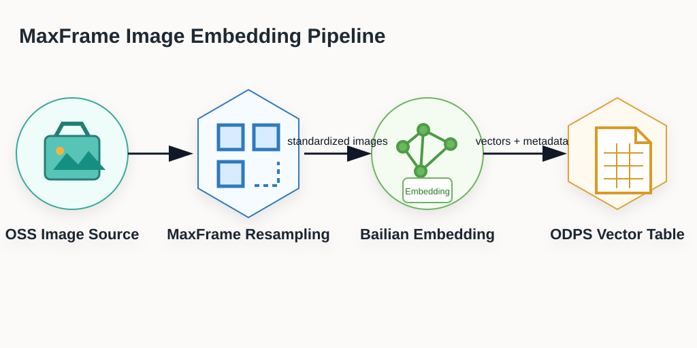
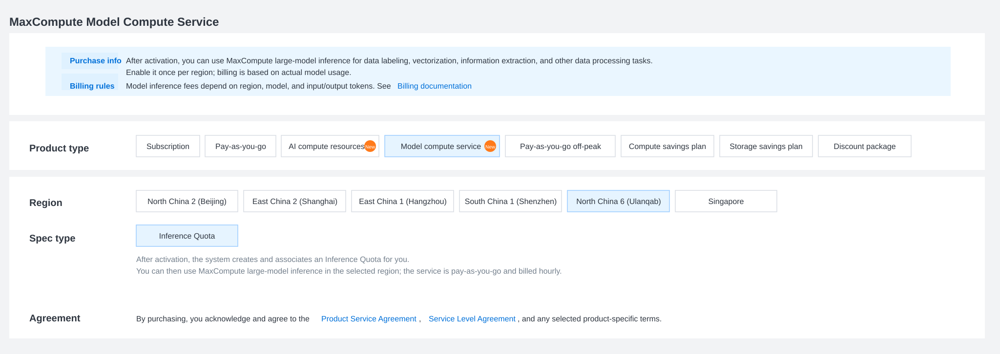

.. _examples_qwen3_vl_oss_embedding:

Multimodal Image Feature Pipeline with MaxFrame
===============================================

.. raw:: html

   
Available at MaxFrame 2.7.1

Background
----------

Enterprise data platforms increasingly rely on multimodal data such as images, text, audio, and video. These data assets are often heterogeneous and unstructured, making them difficult to use directly for search, recommendation, moderation, clustering, and analytics.

A practical pattern is to standardize the pipeline: download and decode raw files, normalize formats, run semantic understanding, generate labels, extract embeddings, and store vectors in a reusable feature table.

This tutorial demonstrates a multimodal image feature pipeline on MaxFrame: distributed image preprocessing, semantic embedding inference, and table persistence for downstream retrieval, recommendation, moderation, clustering, and analytics.

Applicable scenarios
--------------------

- Multimodal retrieval and similar-content recall.
- Feature generation for recommendation and ranking systems.
- Content understanding, moderation, and quality analysis.
- Deduplication and clustering using vector similarity.
- Reusable feature asset construction for enterprise data governance.
- Data preparation for RAG, knowledge base, and agent applications.

Core workflow
-------------

Prerequisites
-------------

.. list-table::
   :header-rows: 1
   :widths: 8 24 68

   * - #
     - Requirement
     - Description
   * - 1
     - **MaxCompute enabled**
     - A MaxCompute project with valid Access ID / Access Key.
   * - 2
     - **DPE enabled**
     - Submit a ticket to enable the DPE engine for your MaxCompute project before running this example.
   * - 3
     - **Images uploaded to OSS**
     - Create your own OSS bucket and upload the five sample images used by this tutorial.
   * - 4
     - **OSS RAM role authorization**
     - Configure Role ARN for OSS read access.
   * - 5
     - **MaxFrame SDK version**
     - Use MaxFrame SDK **2.7.1** or above (``pip install maxframe>=2.7.1``).

Model compute service and inference quota
-----------------------------------------

In MaxCompute console, purchase/enable model compute service and confirm the
associated inference quota before running Bailian model inference.

Configure OSS RAM role
----------------------

Refer to the service enablement and authorization section in
`OSS mounting and use practices <https://help.aliyun.com/zh/maxcompute/user-guide/oss-mounting-and-use-practices>`__
to create an OSS bucket and a RAM role with OSS read permission. In this
example, the code only needs the RAM role ARN passed through ``with_fs_mount``
as ``storage_options={"role_arn": ROLE_ARN}``.

The service-linked-role step shown in the console guide is not used by this
example. If your MaxCompute service has already been enabled, focus on the RAM
role and OSS permission configuration needed by ``role_arn``.

Environment setup
-----------------

.. code-block:: python

   import maxframe

   assert maxframe.__version__ >= "2.7.1", (
       f"maxframe >= 2.7.1 is required, current version: {maxframe.__version__}. "
       f"Please run: pip install --upgrade maxframe"
   )

   import pandas as pd
   import maxframe.dataframe as md
   from maxframe import new_session
   from maxframe.udf import with_python_requirements, with_fs_mount
   from maxframe.config import options
   from odps import ODPS

   pd.set_option("display.max_colwidth", None)
   pd.set_option("display.max_columns", None)

   options.dag.settings = {"engine_order": ["DPE", "MCSQL"]}
   ROLE_ARN = "acs:ram::<your_account_id>:role/<your_role_name>"
   OSS_ENDPOINT = "<your_oss_endpoint>"  # for example: oss-cn-hangzhou.aliyuncs.com
   OSS_BUCKET = "<your_oss_bucket>"
   OSS_IMAGE_PREFIX = "maxframe-image-demo/"

   o = ODPS(
       access_id="<your_access_id>",
       secret_access_key="<your_access_key_secret>",
       project="<your_mc_project>",
       endpoint="https://service.<region>.maxcompute.aliyun.com/api",
   )
   session = new_session(o)
   print(f"Session ID : {session.session_id}")
   print(f"LogView    : {session.get_logview_address()}")

1. Build input dataset
----------------------

Upload these five images to ``oss://<your_oss_endpoint>/<your_oss_bucket>/maxframe-image-demo/``
before running this section. The names in ``IMAGE_FILES`` must exactly match
the objects in your OSS bucket.

.. code-block:: python

   IMAGE_FILES = ["img_001.jpg", "img_002.jpg", "img_003.jpg", "img_004.png", "img_005.jpg"]

   df = md.DataFrame({
       "id": list(range(1, len(IMAGE_FILES) + 1)),
       "filename": IMAGE_FILES,
   })

   # Production path:
   # df = md.read_odps_table("your_image_table", columns=["id", "filename"])

2. Download, decode, and resize images
--------------------------------------

.. code-block:: python

   @with_fs_mount(
       path=f"oss://{OSS_ENDPOINT}/{OSS_BUCKET}/{OSS_IMAGE_PREFIX}",
       mount_path="/mnt/oss_data",
       storage_options={"role_arn": ROLE_ARN},
   )
   @with_python_requirements("Pillow==10.4.0")
   def download_and_process(filename_series, target_size=(512, 512)) -> pd.DataFrame[
       {"width": "float64", "height": "float64", "format": "object", "img_base64": "object"}
   ]:
       import io
       import base64
       import pandas as pd
       from PIL import Image

       results = []
       widths, heights, formats = [], [], []
       for fname in filename_series:
           try:
               img_path = f"/mnt/oss_data/{fname}"
               img = Image.open(img_path)
               widths.append(img.width)
               heights.append(img.height)
               formats.append(img.format)

               img = img.convert("RGB").resize(target_size, Image.LANCZOS)
               buf = io.BytesIO()
               img.save(buf, format="JPEG", quality=85)
               results.append(base64.b64encode(buf.getvalue()).decode("utf-8"))
           except Exception:
               results.append(None)
               widths.append(None)
               heights.append(None)
               formats.append(None)

       return pd.DataFrame(
           {
               "width": widths,
               "height": heights,
               "format": formats,
               "img_base64": results,
           },
           index=filename_series.index,
       )

   result_df = df["filename"].mf.apply_chunk(
       download_and_process,
       target_size=(512, 512),
   )

   df["width"] = result_df["width"]
   df["height"] = result_df["height"]
   df["format"] = result_df["format"]
   df["img_base64"] = result_df["img_base64"]
   df = df.execute()

3. Multimodal embedding inference
---------------------------------

.. code-block:: python

   from maxframe.learn.contrib.llm import ContentPart, ImageContentType
   from maxframe.learn.utils import read_odps_model

   embedding_model = read_odps_model("qwen3-vl-embedding", project="bigdata_public_modelset")
   print(embedding_model)

   embedding_result = embedding_model.embed(
       df,
       input=[
           ContentPart.image(
               data=df["img_base64"],
               type=ImageContentType.BASE64,
               mime_type="image/jpeg",
           ),
       ],
       simple_output=False,
       params={"dimension": 1024},
       running_options={"enable_real_rpm_stats": True},
   )

   df["embedding"] = embedding_result["response"]
   df["embedding_success"] = embedding_result["success"]
   df = df.execute()
   print(df.fetch())

4. Persist embeddings to MaxCompute
-----------------------------------

.. code-block:: python

   md.to_odps_table(
       md.DataFrame(df),
       "image_embedding_result",
       overwrite=True,
   ).execute()

   print("Results written to table: image_embedding_result")

5. Cleanup
----------

.. code-block:: python

   print(f"LogView: {session.get_logview_address()}")
   session.destroy()
   print("Session destroyed.")

Troubleshooting
---------------

.. list-table::
   :header-rows: 1
   :widths: 28 32 40

   * - Issue
     - Cause
     - Resolution
   * - ``Engine DPE not available``
     - DPE is not enabled
     - Ask admin to enable DPE in project.
   * - ``OSS access denied``
     - Wrong or missing role permissions
     - Verify ``role_arn`` and OSS read permissions.
   * - Embedding is ``None``
     - Per-image inference failure
     - Verify image integrity and base64 generation.
